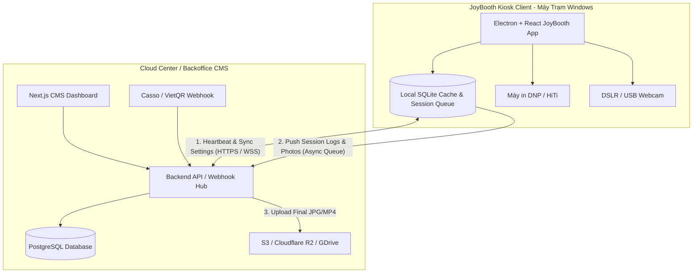
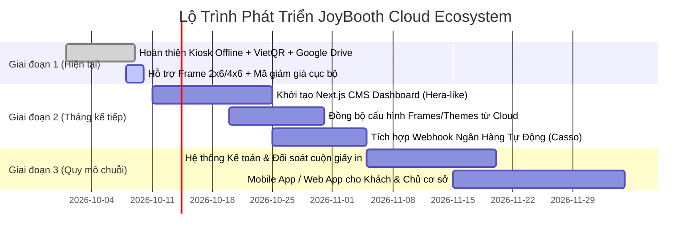

# JOYBOOTH CMS & KẾ TOÁN TẬP TRUNG (CLOUD BACKOFFICE ROADMAP)
*Bản thiết kế kiến trúc toàn diện & Kế hoạch phát triển hệ thống quản trị Kiosk chuỗi Photobooth JoyBooth*

---

## I. TỔNG QUAN PHÂN TÍCH THEO MẪU CMS HERA BOOTH (ẢNH 2)

Dựa trên bảng điều khiển thực tế của **Hera Booth CMS** (`cms.mmcsoftwares.com`), JoyBooth cần một hệ sinh thái Cloud Center kết nối đa điểm các máy Kiosk (Photobooth & Selfbooth) đặt tại nhiều địa điểm, trung tâm thương mại hoặc quán cà phê.

Chúng ta phân tích từng phân hệ với câu hỏi cốt lõi: **"CẦN THIẾT KHÔNG? VÀ TẠI SAO?"**

---

### 1. Phân Tích Từng Module Theo Lăng Kính Thực Chiến

| Menu CMS (Ảnh 2) | Cần thiết không? | Tại sao? (Giá trị kinh doanh & Kỹ thuật) | Mức độ ưu tiên |
| :--- | :--- | :--- | :--- |
| **Hệ thống Thiết bị (Devices / Kiosks)** | **CỰC KỲ CẦN THIẾT** | Giám sát trạng thái hoạt động (Online/Offline, Heartbeat), phiên bản app, nhiệt độ, cảnh báo kẹt giấy in hoặc hết giấy cuộn mà không cần đến tận nơi kiểm tra. | **P0 (Cốt lõi)** |
| **Quản trị Khung hình (Frames & Overlays)** | **CỰC KỲ CẦN THIẾT** | Đẩy mẫu khung mới (Giáng sinh, Tết, Valentine, sự kiện nhãn hàng) lên toàn bộ các kiosk từ xa trong 1 click. Không phải cầm USB cắm từng máy. | **P0 (Cốt lõi)** |
| **Layouts (Bố cục 1, 3, 4, 6, 8 ảnh)** | **CẦN THIẾT** | Bật/tắt bố cục theo từng loại máy (máy máy in 2x6 hay 4x6), tùy chỉnh tọa độ slot ảnh khi đổi máy in. | **P1** |
| **Icon / Sticker Library** | **CẦN THIẾT** | Cập nhật kho sticker trending (Y2K, Capybara, Anime, sinh nhật) liên tục để giữ chân khách trẻ Gen Z. | **P2** |
| **Ảnh chụp & Phiên chụp (Sessions & Cloud Gallery)** | **CỰC KỲ CẦN THIẾT** | Lưu vết lịch sử chụp, link tải ảnh Google Drive/S3 của khách để hỗ trợ CSKH khi khách làm mất ảnh hoặc quét mã QR bị lỗi. | **P0 (Cốt lõi)** |
| **Gói dịch vụ & Bảng giá (Pricing Packages)** | **CỰC KỲ CẦN THIẾT** | Thay đổi giá linh hoạt (giá ngày thường vs giá cuối tuần, giá theo cơ sở TTTM vs cơ sở tỉnh). | **P0 (Cốt lõi)** |
| **Mã giảm giá & Khuyến mãi (Vouchers / Coupons)** | **CỰC KỲ CẦN THIẾT** | Chạy chiến dịch TikTok/Instagram ("Check-in giảm 20K"), phát mã ưu đãi đối tác (quán cafe, nhãn hàng). Tăng trưởng doanh thu 30-40%. | **P1** |
| **Thanh toán & Lịch sử giao dịch (Payment & Ledger)** | **CỰC KỲ CẦN THIẾT (SỐNG CÒN)** | Đối soát tự động giữa VietQR chuyển khoản và Tiền mặt. Ngăn chặn nhân viên gian lận/biển thủ tiền mặt tại quầy booth. | **P0 (Sống còn)** |
| **Lệnh in & Đơn in thêm (Print Queue & Extra Prints)** | **CỰC KỲ CẦN THIẾT** | Quản lý định mức cuộn giấy in (1 cuộn DNP/HiTi in được 400 tấm 4x6 hoặc 800 dải 2x6). Báo động khi cuộn giấy còn dưới 20 tấm để nạp giấy kịp thời. | **P1** |
| **Dung lượng hệ thống (Cloud Storage Quota)** | **CẦN THIẾT** | Kiểm soát chi phí lưu trữ (Google Drive / S3 / R2). Tự động chạy cron dọn dẹp ảnh RAW sau 30 ngày, chỉ giữ bản render. | **P2** |

---

## II. KẾT NỐI GIỮA CLOUD CMS VÀ PHẦN MỀM KIOSK THẾ NÀO?

### 1. Nguyên Tắc Sống Còn: Kiến Trúc "Offline-First"
> **Lưu ý kỹ thuật**: Các máy booth đặt tại trung tâm thương mại hoặc sự kiện ngoài trời thường xuyên gặp sự cố mất mạng Wi-Fi hoặc 4G lag.
> **Nguyên tắc**: Mất kết nối Internet **KHÔNG ĐƯỢC PHÉP** làm sập hay đứng máy chụp và máy in!

### 2. Giao Thức Kết Nối

1. **Đồng bộ xuống (Cloud ➔ Kiosk)**:
   - **Cấu hình & Giá**: Kiosk định kỳ (mỗi 5 phút) gửi heartbeat kèm `config_version`. Nếu Cloud có version mới (ví dụ vừa thêm mã giảm giá mới `VIP2026`), Kiosk tải file JSON cấu hình và áp dụng ngay lập tức mà không cần khởi động lại máy.
   - **Khung ảnh & Sticker**: Kiosk tải background PNG và sticker về thư mục cục bộ `assets/remote/` để khi render canvas có tốc độ tức thì (0ms latency, không phụ thuộc tốc độ tải ảnh mạng).
   - **Lệnh điều khiển khẩn cấp**: Thông qua **WebSocket** (hoặc Supabase Realtime / MQTT): Khóa booth từ xa, khởi động lại app, xuất lệnh in lại.

2. **Đồng bộ lên (Kiosk ➔ Cloud)**:
   - **Hàng đợi không đồng bộ (Local Sync Queue)**: Mỗi khi kết thúc phiên chụp:
     + Kiosk ghi nhận giao dịch vào SQLite cục bộ trước (`status: pending_sync`).
     + Tiến trình chạy ngầm (Worker) đẩy dữ liệu lên Cloud API: `sessionId`, `layoutId`, `copies`, `amount`, `paymentMethod`, `couponCode`.
     + Sau khi Cloud phản hồi 200 OK, cập nhật `status: synced`.
     + Nếu mất mạng, giao dịch được giữ an toàn tại máy trạm và tự động đồng bộ bù ngay khi có mạng trở lại.

---

## III. XÂY BẰNG GÌ? (TECH STACK KHUYẾN NGHỊ)

| Thành phần | Công nghệ đề xuất | Lý do lựa chọn |
| :--- | :--- | :--- |
| **Frontend CMS** | **Next.js 15 (React 19) + Tailwind CSS + Lucide Icons + Shadcn UI** | Cực kỳ hiện đại, load trang siêu tốc, giao diện cao cấp như ảnh Hera Booth, hỗ trợ responsive hoàn hảo trên điện thoại của chủ quán. |
| **Backend API** | **FastAPI (Python) HOẶC NestJS (Node.js/TypeScript)** | FastAPI tích hợp hoàn hảo với các pipeline xử lý ảnh/AI nếu cần mở rộng; NestJS tận dụng 100% TypeScript dùng chung types với Kiosk. |
| **Cơ sở dữ liệu** | **PostgreSQL (Supabase hoặc Neon Serverless)** | Đảm bảo tính toàn vẹn dữ liệu kế toán tài chính (ACID transaction), hỗ trợ query thống kê và phân quyền nhiều chi nhánh tốt nhất. |
| **Lưu trữ ảnh Cloud** | **Cloudflare R2 (hoặc AWS S3) kết hợp Google Drive** | Cloudflare R2 **miễn phí 100% băng thông tải về (Zero Egress Fee)**, chi phí rẻ gấp 10 lần so với AWS S3 truyền thống khi lượng khách quét QR tải ảnh lớn. |
| **Tích hợp VietQR** | **Casso.vn hoặc SeAPay Webhook** | Tự động nhận diện biến động số dư tài khoản ngân hàng trong 1-3 giây, tự động kích hoạt màn hình chụp của Kiosk từ xa. |
| **Phần mềm Kiosk** | **Electron + React + Vite + TypeScript (Hiện tại)** | Đã hoạt động mượt mà, kết nối trực tiếp phần cứng camera và máy in qua Win32 API / CUPS. |

---

## IV. BÀI TOÁN KẾ TOÁN & ĐỐI SOÁT TÀI CHÍNH (ACCOUNTING RECONCILIATION)

Trong kinh doanh chuỗi Photobooth, thất thoát tài chính lớn nhất đến từ:
1. **Tiền mặt không kiểm soát được**: Khách đưa tiền mặt cho nhân viên trực booth nhưng nhân viên bấm nút "Test" hoặc không vào sổ sách.
2. **Hao hụt giấy in**: Số lượng giấy in thực tế tiêu hao nhiều hơn số đơn thanh toán.

### Giải Pháp Kiểm Soát Chống Thất Thoát Của JoyBooth:
1. **Kiểm kê 3 góc (Triple Reconciliation)**:
   - `Góc 1`: Doanh thu ghi nhận trên App Kiosk (`Tổng bill = VietQR + Tiền Mặt`).
   - `Góc 2`: Biến động số dư tài khoản ngân hàng thực tế (Bank Statement).
   - `Góc 3`: Bộ đếm lệnh in phần cứng (Hardware Print Counter từ driver máy in DNP/HiTi).
   - *Công thức đối soát*: `Số bản in tiêu hao = (Số tờ theo đơn hàng) + (Số tờ lỗi in lại có chụp bằng chứng)`. Mọi chênh lệch sẽ được hệ thống gắn cờ cảnh báo (Flag Discrepancy) cho chủ chuỗi.
2. **Khóa nút Test ở chế độ Thương mại**: Nút "Bỏ qua & Vào chụp (Test)" chỉ hoạt động khi có mã PIN của Quản lý cấp cao.
3. **Báo cáo P&L tự động**: Doanh thu - Chi phí giấy in cuộn - Chi phí thuê mặt bằng = Lợi nhuận ròng thời gian thực của từng máy.

---

## V. KẾ HOẠCH TRIỂN KHAI THEO 3 GIAI ĐOẠN

---
*Tài liệu được khởi tạo và duy trì bởi JoyBooth Architecture Team.*
